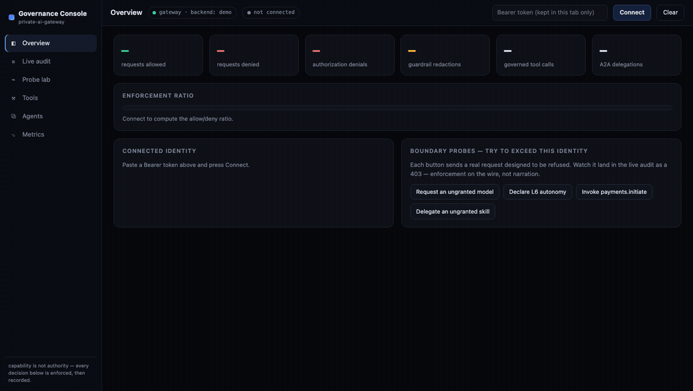
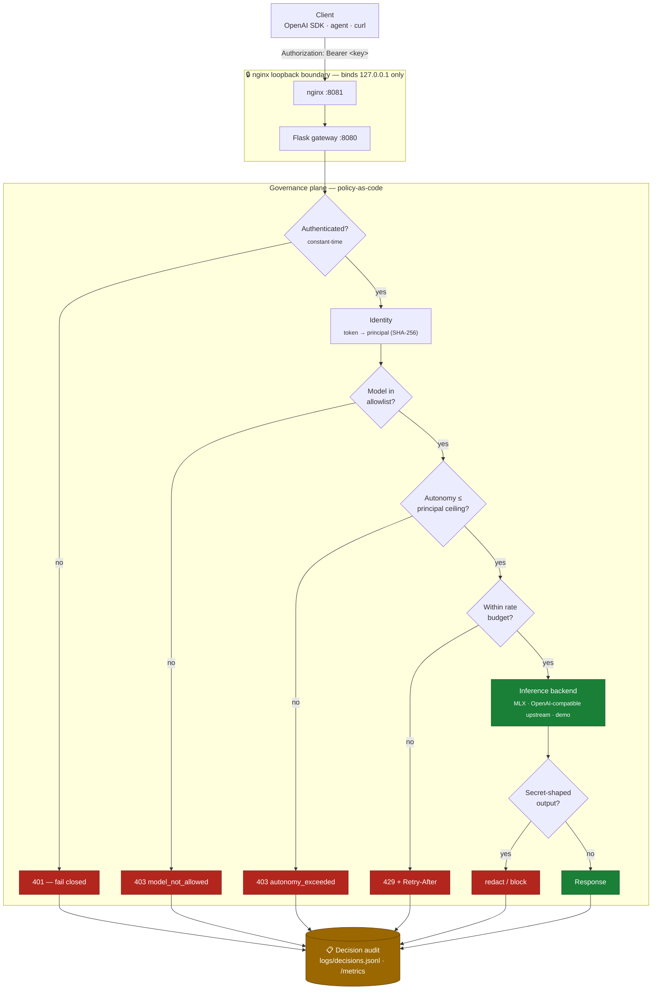
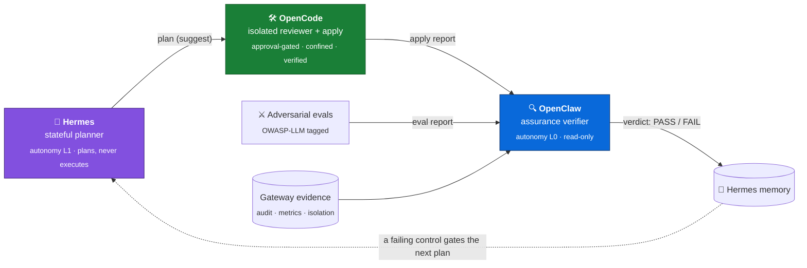

# Private AI Gateway

<!-- If the GitHub slug differs from debshikhar-sec/private-ai-infra, update it in the badge URLs below. -->
[](https://debshikhar-sec.github.io/private-ai-infra/)
[](https://github.com/debshikhar-sec/private-ai-infra/actions/workflows/ci.yml)
[](https://github.com/debshikhar-sec/private-ai-infra/actions/workflows/codeql.yml)


> ## AI capability is not AI authority.
>
> A **model-plane-agnostic AI governance gateway**: OpenAI-compatible on both sides, it
> sits in front of **whatever serves your models** — an enterprise LLM-as-a-Service
> platform, vLLM/TGI/Ollama/LM Studio, or in-process Apple Silicon MLX — and enforces
> **policy-as-code identity, model authorization, an enforced L0–L6 autonomy ceiling,
> per-tool and per-skill grants (MCP/A2A), egress guardrails, and a structured decision
> audit** before any token is generated.
>
> A leaked low-privilege key can't reach a model it was never granted; an agent capped at
> *suggest* can't be handed work that *executes*. Enforced in code, **before any model
> loads** — not asserted in a README — with every allow/deny recorded and independently
> re-verified.

<!-- DEMO: regenerate with `vhs demo/enforce.tape` -->
<p align="center">
  
</p>

<p align="center"><sub>A principal capped at <b>L1 (suggest)</b> is refused <code>403</code> the instant it asks for more — autonomy it doesn't have, or a model it was never granted. Enforced <i>before</i> the model even loads. <a href="#see-it-enforce-no-gif">Text version ↓</a></sub></p>

<!-- Console walkthrough: regenerate frames with the CDP capture rig against `private-ai-gateway demo` -->
<p align="center">
  
</p>

<p align="center"><sub><b>The Governance Console, end to end</b> — five simulated enterprise agent identities driving the real enforcement code (<code>private-ai-gateway demo</code>). Scroll-driven, step-by-step version with the reasoning behind each frame: <a href="https://debshikhar-sec.github.io/private-ai-infra/#tour"><b>the product tour</b></a>.</sub></p>

---

## How it enforces

Every request crosses the loopback boundary and runs a fixed gauntlet of checks. Each
gate fails **closed** with a specific status, and every outcome — allow or deny — is
written to the decision audit and the metrics counters.



Note the ordering: **authz, autonomy, and rate-limit denials all happen *before* the
model loads** — an unauthorized or runaway request is rejected cheaply, never paying for
inference it wasn't allowed to run.

## Proven, not asserted

The differentiator isn't that these controls exist — it's that they are **attacked** by
an adversarial eval suite that fails CI on regression, and **independently re-verified**
by a read-only assurance agent (OpenClaw) that reconciles the audit, metrics, and policy.
Each row is a control, the attack against it, and where that attack is proven to fail:

| Control | Attack it repels | Enforced in | Proven by |
|---|---|---|---|
| Fail-closed auth | unauthenticated / wrong token | `app.py` (constant-time) | `evals` AUTHN-001/002 · `test_auth` |
| Identity + model authz | low-priv key reaches an ungranted model | `policy.py` → `403` | `evals` AUTHZ-001 · `test_policy` |
| **Autonomy ceiling** | agent declares more autonomy than its mandate | `autonomy.py` → `403` | `evals` AUTONOMY-001/002 · `test_autonomy` |
| Autonomy **under-declare** | low level in header, high in body | `declared_level` (most-privileged-wins) | `evals` **AUTONOMY-004** — the real bug it caught |
| Rate limiting | one key saturates the gateway | `ratelimit.py` → `429` | `evals` RATELIMIT-001 · `test_ratelimit` |
| Secret egress | model surfaces an AWS key / JWT / PEM | `guardrails.py` redact/block | `evals` EGRESS-001…004 · `test_guardrails` |
| **Captured-model bound** | injection / context-poisoning hijacks the model itself | authority decided **off the prompt path** | `evals` **AGENTIC-001/002/003** — OWASP Agentic ASI01/03/06 |
| **A2A delegation** | an agent is handed a skill / autonomy beyond its mandate | `/a2a/tasks` → `403` skill_not_allowed / autonomy_exceeded | `evals` **A2A-001/002** — OWASP Agentic ASI03/07 |
| **MCP tool access** | a principal invokes an ungranted or over-privileged tool | `/mcp/call` → `403` tool_not_allowed / autonomy_exceeded | `evals` **MCP-001/002** — OWASP Agentic ASI02 (incl. *granted-but-floor-gated* `payments.initiate`) |
| **Audit read access** | a low-priv key tails every principal's allow/deny history | `/v1/decisions` → `403` audit_not_allowed (`can_read_audit` grant) | `evals` **AUDIT-001** — OWASP Agentic ASI03 |
| **Ingress prompt injection** | a jailbreak / instruction-override rides in on the prompt — even Unicode-obfuscated | `ingress.py` (normalize → detect) → `403` prompt_injection_blocked | `evals` **INGRESS-001…003** — OWASP **LLM01**, incl. homoglyph/zero-width evasion |
| **Delegation attenuation** | an agent hands off more authority than it holds, or a chain widens/recurses | `delegation.py` → `403` autonomy_amplification / delegation_widening / too_deep | `test_delegation` · `test_orchestrate` (full governed loop + probes) |
| **AI-stack CVE gate** | a known-vulnerable inference dependency ships to prod | `vulnintel.py` OSV/CVSS gate → non-zero exit | `test_vulnintel` · `make scan` (ShadowRay, SSTI, deserialization) |
| Apply integrity | an apply runs ungated or escapes its sandbox | `opencode_sandbox/apply.py` | OpenClaw `AC-APPLY-INTEGRITY` · `test_opencode_act` |

→ Run the attacks yourself: `make evals` · Watch agents delegate under attenuating authority: `make orchestrate` · Scan the AI supply chain: `make scan`.

## Orchestration control plane

The gateway is the enforcement substrate for a three-component agent control plane. Each
component authenticates as its **own principal** with its own model allowlist and autonomy
ceiling — there is no shared "god" identity. They form a closed **plan → act → verify →
record** loop where a model may *reason* about anything, but what *executes* is decided
and recorded by the governance plane.



Full design and current-vs-planned status: **[docs/orchestration.md](docs/orchestration.md)**.

**These agents now understand and delegate to each other autonomously — under governed,
attenuating authority.** Discovery is from policy, not self-description: each agent reads
the `GET /a2a/agents` directory (skills + enforced autonomy ceiling per peer) and routes
work to the least-privileged capable peer. A hand-off is a policy decision — *skill
possession* is the right to route a task type, *autonomy ceiling* the right to execute it —
so a planner at L1 can route an L3 apply to an executor that policy grants L3, but nothing
can amplify authority: chains only narrow, depth is bounded, only a task's holder may
sub-delegate it, and only its delegatee may report the result. OpenCode applies in a
confined sandbox and *sub-delegates* verification to OpenClaw, which verifies from gateway
evidence and reports PASS/FAIL back up the chain.

```console
$ make orchestrate      # the full governed loop, offline, through the real enforcement plane
hermes -> opencode  code.apply@L3   [completed PASS]
  opencode -> openclaw  assurance.verify@L2   [completed PASS]
  [PASS] hermes    asks opencode to run at L5 — above its enforced ceiling  -> 403 autonomy_amplification
  [PASS] hermes    routes payments.initiate — a skill it was never granted  -> 403 skill_not_delegable
  [PASS] openclaw  grows the chain past the policy depth limit              -> 403 delegation_too_deep
  10/10 steps behaved exactly as policy demands.
```

## See it enforce (no GIF)

With a policy active, the `hermes` token resolves to a principal capped at **L1 (suggest),
models `["strategy"]`**. Every attempt to exceed that mandate is refused on the wire,
before any model loads:

```console
$ curl -s -XPOST :8081/v1/chat/completions -H "Authorization: Bearer $HERMES" \
       -H "X-Autonomy-Level: 6" -d '{"model":"strategy","messages":[...]}'
{"error":{"code":"autonomy_exceeded","message":"Principal 'hermes' is capped at
 autonomy L1 (suggest); request declared L6 (unbounded)","type":"permission_error"}}
HTTP 403

$ curl ... -d '{"model":"offsec","messages":[...]}'          # not in its allowlist
{"error":{"code":"model_not_allowed","message":"Principal 'hermes' is not permitted
 to use model 'offsec'","type":"permission_error"}}
HTTP 403

$ curl ... -H "X-Autonomy-Level: 1" -d '{"autonomy_level":6,...}'   # under-declare
{"error":{"code":"autonomy_exceeded", ...}}    # most-privileged-wins: still 403
HTTP 403
```

The denials land in `logs/decisions.jsonl` and `/metrics`; OpenClaw then reconciles them
(`AC-AUTONOMY-CEILING` / `AC-AUTHZ-MODEL` → PASS). That's the whole thesis, observable on
`127.0.0.1`. Reproduce it: [docs/runbook.md](docs/runbook.md#live-enforcement-demo).

## Quickstart

**Try it in 60 seconds — any machine, no model, no network (starter kit):**

```bash
python -m venv venv && source venv/bin/activate
pip install .                       # platform-agnostic; installs the console command
private-ai-gateway demo             # demo policy + scripted governed traffic + console
```

The demo loads a simulated financial-enterprise cast of agent principals
(research-copilot, kyc-screening-agent, a suggest-only trading-assistant, an
ops-automation agent, an auditor), replays a scripted day of traffic through the **real
enforcement code** — model denials, autonomy-ceiling refusals, a granted-but-floor-gated
payments tool, A2A delegation, a live guardrail redaction — and prints the demo tokens.
Then open **http://127.0.0.1:8080/console** and explore what just happened.

**Point it at the model plane you already have (any OpenAI-compatible endpoint):**

```bash
export PRIVATE_AI_AUTH_TOKEN=...                        # fail-closed: required to serve
export PRIVATE_AI_UPSTREAM_API_KEY=...                  # upstream credential (if any)
private-ai-gateway serve --backend openai \
  --upstream-base-url http://127.0.0.1:11434/v1         # Ollama, vLLM, TGI, LLMaaS, …
```

Model aliases stay stable while the plane changes: map them in `config/policy.toml`
under `[models.routes]` (e.g. `strategy = "mistral-large-latest"`).

**Or fully local, in-process on Apple Silicon:**

```bash
pip install .[mlx]
export PRIVATE_AI_AUTH_TOKEN=...
private-ai-gateway serve            # Flask on 127.0.0.1:8080
```

Every path serves the **Governance Console** at `/console` — an app-style dashboard:
overview stat cards and the allow/deny enforcement ratio, a live filterable
decision-audit feed, a probe lab (chat, tool calls, A2A delegation), your granted tools
with their autonomy floors, your policy-derived agent card, and one-click boundary
probes that get themselves refused on the wire. (The page is a static, data-free shell
under a strict CSP; every byte it displays is fetched with the token you paste.)

**Or the hardened loopback stack (Flask behind the nginx boundary):**

```bash
make install && cp .env.example .env && make start && make status

curl -s http://127.0.0.1:8081/v1/models \
  -H "Authorization: Bearer $PRIVATE_AI_AUTH_TOKEN" | python3 -m json.tool

make stop
```

With no policy file the gateway runs single-principal (owner, all models) so local dev is
zero-config. Drop in `config/policy.toml` to enable the per-principal ceilings shown above.

### Governed agentic surfaces (A2A + MCP)

The same plane that gates inference also gates **agent-to-agent delegation** and **tool
calls** — capability is not authority on any surface:

```console
$ curl :8080/.well-known/agent-card.json -H "$H"     # A2A discovery: skills + autonomy ceiling (from policy)
$ curl :8080/a2a/tasks  -H "$H" -d '{"skill":"deploy.prod"}'        # 403 skill_not_allowed
$ curl :8080/mcp/call   -H "$H" -d '{"tool":"shell.exec"}'         # 403 tool_not_allowed
$ curl :8080/mcp/call   -H "$H" -d '{"tool":"clock.now"}'          # 200 — granted + within autonomy
```

## Documentation

| Doc | What it covers |
|---|---|
| [Architecture](docs/architecture.md) | request path, planes, model routing |
| [**Starter kit / demo**](docs/demo.md) | the one-command scripted governance demo and its simulated principals |
| [Security model](docs/security-model.md) | trust boundaries, OWASP-LLM risks + a **MITRE ATLAS technique map** (pertinent vs. out-of-scope), honest limits |
| [**Threat model**](docs/threat-model.md) | STRIDE per trust boundary → control → the eval that proves it |
| [Orchestration](docs/orchestration.md) | the control plane, autonomy ladder, closed loop |
| [**Delegation & defensive suite**](docs/delegation-and-defense.md) | governed A2A delegation (attenuation + sub-delegation), the ingress AI-firewall, AI-stack CVE intelligence, and the context optimizer — with honest scoping |
| [Runbook](docs/runbook.md) | operating the stack + the live enforcement demo |
| [**Product evolution**](docs/product-evolution.md) | OWASP Agentic Top-10 coverage map + threat-led roadmap vs. the AI-gateway field |
| [Roadmap](docs/roadmap.md) | what's hardened, what's next |

## Project layout

```text
src/private_ai_gateway/   # gateway (app.py) + governance (policy, ratelimit, guardrails, metrics, audit, autonomy)
                          #   + delegation.py, ingress.py (AI-firewall), vulnintel.py (CVE scan), contextopt.py
config/                   # policy.example.toml — governance policy-as-code
deploy/nginx/             # nginx loopback reverse-proxy config
agents/                   # control plane: hermes/ (planner + orchestrate), opencode_sandbox/ + openclaw/ (workers), interop/ (shared peer client)
evals/                    # adversarial security evals — attack the controls, OWASP-LLM tagged
tests/                    # unit/ (pytest) + integration/ (stack smoke test)
docs/                     # architecture, security & threat model, orchestration, runbook, roadmap
```

## Status & limitations (honest)

- Gateway is **text-compatible, not tool-execution-compatible** — by design; it refuses to fake tool calls.
- Autonomy/egress gating is **opt-in via policy**; with no policy file the owner token is all-models break-glass.
- Guardrails are high-precision **regex denylists** (defense-in-depth, not exhaustive recall).
- API keys are **static** (no rotation/expiry yet); rate limiting is **in-process, per-node**.
- **No TLS** — loopback use only. The optional MLX backend is Apple-Silicon only; the
  gateway itself (and its full test suite) runs on any platform.
- The starter-kit tools are **simulated** (pure, deterministic) — they exist to make the
  *enforcement* demonstrable, and are labeled `"simulated": true` so nobody mistakes the
  demo for a payments system.

## License

[MIT](LICENSE)
